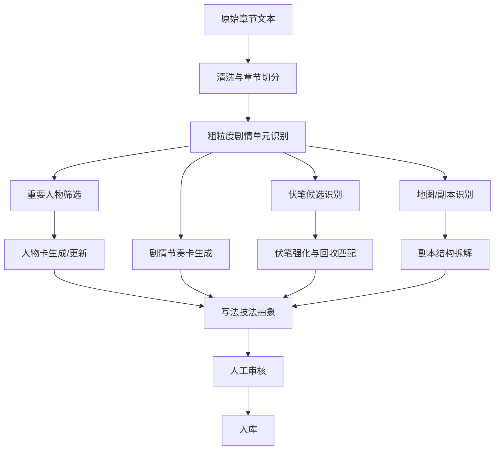

# 网文写作学习型拆解系统设计

> 目标：本系统不是做小说百科，也不是把所有设定拆成知识图谱，而是把成熟网文拆成可复用的写作经验：人物为什么好看，剧情为什么能追，伏笔怎么埋和回收，地图/副本如何推动成长。

## 1. 系统定位

### 1.1 不是要拆什么

不以“万物入库”为目标，以下内容只在影响叙事时记录：

- 路人角色
- 普通物品
- 一次性地点
- 无剧情功能的设定名词
- 纯战力数值
- 无回收价值的背景信息

### 1.2 真正要拆什么

核心拆解对象只有四类：

1. 人物卡：主角、女主、主要男配、主要女配、反派、导师、关键工具人。
2. 剧情节奏卡：剧情单元如何起、承、转、合，如何制造期待和追读。
3. 伏笔卡：伏笔如何出现、强化、误导、回收，回收时造成什么爽点或情绪释放。
4. 地图/副本卡：新地图如何带来新规则、新资源、新压力、新人物、新成长。

辅助沉淀一类：

5. 写法技法卡：把具体案例抽象成可复用的写作方法。

## 2. 参考叙事模型的网文化改造

外部叙事模型可以作为参考，但不能机械套用。

### 2.1 三幕式的网文改造

传统三幕式常用“设置、对抗、解决”的结构。网文中可以改造成：

```text
铺垫期待 -> 升级压迫 -> 爽点兑现 / 新期待开启
```

对应到章节：

```text
起：角色处境、目标、问题出现
承：阻碍升级、信息补充、读者期待增强
转：意外、反转、危机、选择、底牌出现
合：阶段结果、情绪释放、伏笔回收、新钩子
```

### 2.2 Save the Cat 节拍的网文改造

Save the Cat 常见节拍包括开场形象、主题、设置、催化事件、中点、失落、结局等。网文中不必按 15 节拍硬套，而是转化为：

```text
开场钩子
主角困境
核心羞辱/缺口
目标确立
金手指/新变量
第一次验证
阻碍升级
中段反转
低谷/代价
底牌兑现
阶段高潮
新地图/新敌人
```

### 2.3 Story Circle 的网文改造

Story Circle 可理解为：角色有欲望，进入陌生情境，适应，付出代价，获得结果，并因此改变。网文副本特别适合这个循环：

```text
想要资源/答案/晋级
进入新地图
遭遇新规则
试错和受压
发现隐藏机会
付出代价或暴露底牌
获得收益
带着变化离开
```

## 3. 核心数据模型

### 3.1 Project

```json
{
  "project_id": "work_001",
  "title": "作品名",
  "genre": ["玄幻", "升级流"],
  "source": "文本来源",
  "analysis_goal": "学习开局节奏、人物塑造、副本设计",
  "created_at": "2026-05-23"
}
```

### 3.2 StoryUnit 剧情单元

剧情单元是本系统最重要的拆解粒度，不建议按单章机械拆。

一个剧情单元通常覆盖 3-20 章，满足以下任意条件：

- 有一个阶段性目标。
- 有一组明确阻碍。
- 有完整的小起承转合。
- 有阶段性爽点、虐点、悬念或反转。
- 结束时主角状态发生变化。

```json
{
  "unit_id": "unit_001",
  "title": "退婚立誓",
  "chapter_range": [1, 3],
  "unit_type": "开局冲突",
  "core_question": "主角如何回应公开羞辱？",
  "protagonist_goal": "保住尊严，并证明未来能赢回来",
  "main_obstacle": "女方退婚、家族旁观、主角实力低谷",
  "reader_hook": "三年后他能不能打回来？",
  "emotional_curve": ["压抑", "愤怒", "爆发", "期待"],
  "start_state": "主角被视为废物",
  "end_state": "主角立下长期目标",
  "payoff": "精神层面不输，长期爽点建立",
  "next_hook": "他如何恢复实力？",
  "evidence": ["chapter_1", "chapter_2", "chapter_3"],
  "writing_takeaway": "开局可以让主角暂时输掉局面，但不能输掉精神姿态。"
}
```

### 3.3 CharacterCard 人物卡

人物卡只拆重要人物。

```json
{
  "character_id": "char_001",
  "name": "主角名",
  "role_type": "主角",
  "narrative_function": ["承载爽点", "推动升级", "制造情绪认同"],
  "first_appearance": "chapter_1",
  "initial_tags": ["天才陨落", "不服输", "被轻视"],
  "core_desire": "重新证明自己",
  "external_goal": "完成三年之约",
  "internal_lack": "从自尊受伤到真正成熟",
  "charm_points": ["嘴硬但重情", "逆境不跪", "能忍也能爆"],
  "reader_empathy": ["被羞辱", "被误解", "努力后得到回报"],
  "conflict_sources": ["实力不足", "身份低", "敌人强", "资源少"],
  "growth_path": [
    {
      "unit_id": "unit_001",
      "before": "被动受辱",
      "after": "主动立誓",
      "change_type": "目标确立"
    }
  ],
  "relationship_tensions": [
    {
      "target": "反派/女主/导师",
      "relationship": "敌对/情感/师徒",
      "tension": "羞辱与证明",
      "function": "制造长期期待"
    }
  ],
  "writing_takeaway": "人物魅力不只来自能力，也来自他在压力下如何选择。"
}
```

### 3.4 RhythmCard 剧情节奏卡

```json
{
  "rhythm_id": "rhythm_001",
  "unit_id": "unit_001",
  "beat_sequence": [
    {
      "beat": "hook",
      "content": "主角当前处境异常糟糕",
      "function": "让读者快速进入问题"
    },
    {
      "beat": "pressure",
      "content": "外部羞辱公开发生",
      "function": "情绪压迫升级"
    },
    {
      "beat": "turn",
      "content": "主角提出三年之约",
      "function": "从被动转主动"
    },
    {
      "beat": "payoff",
      "content": "尊严守住，长期目标确立",
      "function": "释放情绪并制造追读"
    }
  ],
  "pacing_density": {
    "conflict_count": 3,
    "reveal_count": 1,
    "payoff_count": 1,
    "new_hook_count": 1
  },
  "chapter_hooks": [
    {
      "chapter": 1,
      "hook_type": "异常",
      "hook": "主角为什么从天才变废物？"
    }
  ],
  "writing_takeaway": "每个剧情单元最好同时有当前问题和未来问题：当前问题负责读完本章，未来问题负责追完整段。"
}
```

### 3.5 ForeshadowCard 伏笔卡

```json
{
  "foreshadow_id": "fs_001",
  "name": "神秘戒指",
  "foreshadow_type": "金手指伏笔",
  "first_appearance": "chapter_1",
  "surface_info": "普通旧物",
  "hidden_info": "寄宿强者灵魂",
  "planting_method": "异常现象与普通物件绑定",
  "reader_state_at_planting": "疑惑",
  "reinforcement_nodes": [
    {
      "chapter": 2,
      "method": "重复异常",
      "effect": "让读者意识到问题不是偶然"
    }
  ],
  "misdirection": "看似是主角自身出问题",
  "payoff_node": "chapter_5",
  "payoff_effect": "解释废柴原因，并开启金手指",
  "payoff_type": "解释 + 赋能",
  "writing_takeaway": "强伏笔最好前期制造异常，回收时同时解释旧问题并打开新能力。"
}
```

### 3.6 MapDungeonCard 地图/副本卡

```json
{
  "map_id": "map_001",
  "name": "魔兽山脉",
  "map_type": "成长副本",
  "entry_reason": "主角需要资源和实战经验",
  "entry_cost": "离开保护区，面对真实危险",
  "new_rules": ["魔兽横行", "资源靠争夺", "实力决定生存"],
  "core_resources": ["药材", "魔核", "实战经验", "新人物关系"],
  "core_threats": ["魔兽", "佣兵", "环境", "隐藏强者"],
  "key_characters": ["女主/女配", "临时队友", "阶段敌人"],
  "plot_functions": [
    "升级主角能力",
    "引入新人物",
    "扩大世界观",
    "制造阶段危机",
    "埋下后续地图线索"
  ],
  "internal_structure": [
    "进入陌生地图",
    "展示新规则",
    "小危机验证能力",
    "遇到关键人物",
    "发现隐藏资源",
    "爆发核心冲突",
    "获得收益离开",
    "带出新钩子"
  ],
  "exit_change": "主角实力、关系、信息或资源至少一项升级",
  "writing_takeaway": "副本不是换场景，而是用新规则重新测试主角。"
}
```

### 3.7 TechniqueCard 写法技法卡

写法技法卡是最终沉淀物，比原始剧情更重要。

```json
{
  "technique_id": "tech_001",
  "name": "开局羞辱建立长期目标",
  "category": "开局 / 爽点 / 人物动机",
  "source_work": "作品名",
  "source_units": ["unit_001"],
  "pattern": "让主角在低谷遭遇公开羞辱，但通过立誓、反击或选择保住精神尊严。",
  "why_it_works": [
    "读者迅速理解主角为什么必须变强",
    "情绪压迫带来后续打脸期待",
    "长期目标天然形成"
  ],
  "usable_when": ["升级流开局", "复仇线", "退婚流", "逆袭流"],
  "risks": ["羞辱过度会显得刻意", "主角反应太软会流失读者"],
  "reuse_template": "主角旧身份/尊严被公开否定 -> 对方提出不可接受条件 -> 主角无法现实取胜 -> 主角用誓言/条件/智慧保住精神主动权 -> 形成长期约定。"
}
```

## 4. 拆分算法设计

### 4.1 总体流程



### 4.2 输入输出

输入：

```json
{
  "work_id": "work_001",
  "chapters": [
    {
      "chapter_index": 1,
      "title": "第一章",
      "text": "章节正文"
    }
  ],
  "analysis_focus": ["人物", "节奏", "伏笔", "副本"]
}
```

输出：

```json
{
  "story_units": [],
  "character_cards": [],
  "rhythm_cards": [],
  "foreshadow_cards": [],
  "map_dungeon_cards": [],
  "technique_cards": [],
  "review_tasks": []
}
```

## 5. 关键算法模块

### 5.1 剧情单元识别算法

目的：把连续章节合并成“可分析的剧情段”。

#### 识别信号

强切分信号：

- 新地图开启：来到、进入、前往、抵达、离开。
- 新目标出现：必须、决定、任务、约定、考核、试炼。
- 阶段目标完成：获胜、突破、离开、完成、结束、真相揭晓。
- 大反转：没想到、原来、竟然、真正、身份暴露。
- 时间跳跃：三日后、半年后、翌日、与此同时。
- 对手切换：新的反派、势力、副本 boss 登场。

弱切分信号：

- 章节标题变化。
- 主要出场人物变化。
- 情绪曲线从压抑转释放。
- 主角状态更新。

#### 伪代码

```python
def segment_story_units(chapters):
    units = []
    current = new_unit(start_chapter=chapters[0].index)

    for chapter in chapters:
        signals = detect_boundary_signals(chapter)
        current.add(chapter)

        if should_close_unit(current, signals):
            current.summary = summarize_unit(current)
            current.unit_type = classify_unit_type(current)
            units.append(current)
            current = new_unit(start_chapter=chapter.index + 1)

    if current.has_content():
        units.append(current)

    return merge_too_small_units(units)
```

#### should_close_unit 规则

```text
满足任意强信号 + 当前单元已有明确目标和结果，可以切。
连续 8-12 章无强信号，但目标/地点/人物已明显变化，可以切。
如果只是单章悬念，不切，归入当前剧情单元。
```

### 5.2 重要人物筛选算法

目的：只保留对写作学习有价值的人物。

#### 评分维度

```text
人物重要度 = 出场频率 * 0.2
          + 与主角互动强度 * 0.25
          + 是否改变剧情方向 * 0.25
          + 是否承载情绪/爽点 * 0.2
          + 是否跨单元存在 * 0.1
```

#### 角色分类

```text
主角：视角中心 + 目标连续 + 状态变化最多
女主/男主情感对象：高情感互动 + 关系张力 + 长期陪伴或关键影响
主要男配/女配：多次协助/竞争/映照主角
阶段反派：当前单元主要阻碍制造者
长线反派：跨多个单元制造压力
导师：提供规则、能力、资源或世界解释
工具人：推动单次关键信息、资源或事件
```

#### 输出要求

低于阈值的人物不建完整人物卡，只允许作为剧情卡中的辅助人物出现。

### 5.3 剧情节奏拆解算法

目的：把剧情单元拆成“读者为什么愿意追”的结构。

#### 节拍标签

```text
hook：钩子，提出问题或异常
setup：铺垫，介绍处境/规则/人物
pressure：压迫，阻碍增强
choice：选择，主角做出决定
reveal：揭示，给出新信息
twist：反转，预期被改变
payoff：兑现，爽点/虐点/情绪释放
cost：代价，主角付出损失
upgrade：升级，能力/资源/关系变化
new_hook：新钩子，开启下一段期待
```

#### 节奏卡生成步骤

```text
1. 找本单元的核心问题。
2. 找主角目标。
3. 找阻碍来源。
4. 标记每章结尾钩子。
5. 抽取情绪曲线。
6. 判断爽点/虐点/悬念点。
7. 判断结尾是否完成兑现。
8. 总结写法启发。
```

#### LLM Prompt

```text
你是网文写作拆解助手。请分析以下剧情单元，不要做百科式总结，而要分析它为什么能让读者追读。

请输出 JSON：
- core_question：本单元让读者关心的核心问题
- protagonist_goal：主角目标
- obstacles：阻碍
- beat_sequence：节拍序列，每个节拍包含 beat/content/function
- emotional_curve：情绪曲线
- payoff：本单元兑现了什么
- new_hook：结尾留下什么新期待
- writing_takeaway：可复用写法总结

要求：
- 只依据原文。
- 推断必须标记 inferred=true。
- 每条结论尽量附原文证据或章节位置。

文本：
{{story_unit_text}}
```

### 5.4 伏笔识别与回收匹配算法

目的：发现“现在看不懂，以后会变重要”的信息。

#### 伏笔候选信号

- 异常物品被反复提到。
- 人物身份语焉不详。
- 出现未解释的能力、梦境、血脉、记忆。
- 角色说出预言、警告、约定。
- 主角暂时无法理解的信息。
- 作者刻意写了但当前剧情没有立即作用的细节。
- 地图中提到更高级区域或禁地。

#### 伏笔分类

```text
身份伏笔
能力伏笔
金手指伏笔
地图伏笔
反派伏笔
关系伏笔
规则伏笔
危机伏笔
情感伏笔
```

#### 回收匹配规则

```text
如果后文事件解释了前文异常，则建立 resolves 关系。
如果后文事件让前文约定兑现，则建立 payoff 关系。
如果后文信息推翻前文理解，则建立 reframes 关系。
如果伏笔多次被提醒但未回收，则状态为 active。
```

#### 伪代码

```python
def track_foreshadows(units):
    active = []
    resolved = []

    for unit in units:
        candidates = extract_foreshadow_candidates(unit)

        for candidate in candidates:
            active.append(candidate)

        for fs in active:
            match = find_payoff(fs, unit)
            if match:
                fs.payoff_node = unit.id
                fs.payoff_effect = analyze_payoff_effect(fs, match)
                resolved.append(fs)
                active.remove(fs)

    return active, resolved
```

### 5.5 地图/副本识别算法

目的：识别“新空间如何承载阶段剧情”。

#### 地图/副本成立条件

满足至少三项：

- 主角进入新地点或封闭空间。
- 出现新规则。
- 有明确进入目标。
- 存在新资源。
- 存在新危险。
- 出现阶段敌人或关键人物。
- 离开时主角状态改变。

#### 副本结构分析

```text
进入原因
进入门槛
地图规则
资源分布
危险分布
关键人物
阶段 boss
中途反转
最终收益
离开钩子
```

#### LLM Prompt

```text
请判断以下剧情单元是否构成地图/副本。

如果是，请输出：
- map_name
- map_type
- entry_reason
- new_rules
- core_resources
- core_threats
- key_characters
- internal_structure
- exit_change
- writing_takeaway

如果不是，请输出 is_map_dungeon=false，并说明原因。

文本：
{{story_unit_text}}
```

### 5.6 写法技法抽象算法

目的：把案例变成可复用知识。

#### 抽象步骤

```text
1. 从人物卡、节奏卡、伏笔卡、副本卡中提取 writing_takeaway。
2. 合并相似技法。
3. 标注适用类型。
4. 标注风险。
5. 生成可复用模板。
```

#### 技法合并规则

```text
如果两个技法解决同一写作问题，且结构相似，则合并。
如果同一技法用于不同题材，则保留题材变体。
如果只是情节不同但机制相同，则沉淀为同一模式。
```

## 6. AI 辅助实现建议

### 6.1 推荐流水线

```text
规则切分负责稳定边界。
AI 负责理解剧情功能。
人工审核负责判断是否值得入库。
```

不要让 AI 一次性读完整本书后输出所有内容。推荐：

```text
每 5-10 章形成候选剧情单元
每个剧情单元独立分析
再跨单元合并人物、伏笔、技法
```

### 6.2 模型调用层级

低成本模型：

- 章节清洗
- 标题识别
- 人物候选
- 地点候选
- 章节摘要

高能力模型：

- 剧情单元边界判断
- 人物叙事功能
- 伏笔识别与回收
- 节奏拆解
- 写法技法抽象

人工审核：

- 人物重要性
- 技法是否真的有学习价值
- 伏笔是否过度解读
- 节奏拆解是否贴近阅读体验

### 6.3 置信度标准

```text
0.90-1.00：原文明确支持，且叙事功能清晰。
0.75-0.90：原文支持，但功能判断带一定推断。
0.60-0.75：可能成立，建议人工审核。
0.60 以下：不入正式库，只放候选。
```

## 7. 数据库存储建议

### 7.1 关系型表

```sql
CREATE TABLE story_unit (
  unit_id TEXT PRIMARY KEY,
  work_id TEXT NOT NULL,
  title TEXT,
  chapter_start INTEGER,
  chapter_end INTEGER,
  unit_type TEXT,
  core_question TEXT,
  protagonist_goal TEXT,
  main_obstacle TEXT,
  reader_hook TEXT,
  emotional_curve JSON,
  payoff TEXT,
  next_hook TEXT,
  writing_takeaway TEXT,
  confidence REAL
);

CREATE TABLE character_card (
  character_id TEXT PRIMARY KEY,
  work_id TEXT NOT NULL,
  name TEXT NOT NULL,
  role_type TEXT,
  narrative_function JSON,
  initial_tags JSON,
  core_desire TEXT,
  external_goal TEXT,
  internal_lack TEXT,
  charm_points JSON,
  reader_empathy JSON,
  conflict_sources JSON,
  growth_path JSON,
  relationship_tensions JSON,
  writing_takeaway TEXT,
  confidence REAL
);

CREATE TABLE rhythm_card (
  rhythm_id TEXT PRIMARY KEY,
  unit_id TEXT NOT NULL,
  beat_sequence JSON,
  pacing_density JSON,
  chapter_hooks JSON,
  emotional_curve JSON,
  payoff TEXT,
  new_hook TEXT,
  writing_takeaway TEXT,
  confidence REAL
);

CREATE TABLE foreshadow_card (
  foreshadow_id TEXT PRIMARY KEY,
  work_id TEXT NOT NULL,
  name TEXT,
  foreshadow_type TEXT,
  first_appearance TEXT,
  surface_info TEXT,
  hidden_info TEXT,
  planting_method TEXT,
  reinforcement_nodes JSON,
  misdirection TEXT,
  payoff_node TEXT,
  payoff_effect TEXT,
  status TEXT,
  writing_takeaway TEXT,
  confidence REAL
);

CREATE TABLE map_dungeon_card (
  map_id TEXT PRIMARY KEY,
  work_id TEXT NOT NULL,
  name TEXT,
  map_type TEXT,
  entry_reason TEXT,
  entry_cost TEXT,
  new_rules JSON,
  core_resources JSON,
  core_threats JSON,
  key_characters JSON,
  plot_functions JSON,
  internal_structure JSON,
  exit_change TEXT,
  writing_takeaway TEXT,
  confidence REAL
);

CREATE TABLE technique_card (
  technique_id TEXT PRIMARY KEY,
  name TEXT,
  category TEXT,
  source_work TEXT,
  source_units JSON,
  pattern TEXT,
  why_it_works JSON,
  usable_when JSON,
  risks JSON,
  reuse_template TEXT,
  confidence REAL
);
```

## 8. 质量控制

### 8.1 防止百科化

每条入库内容必须回答至少一个问题：

```text
它如何塑造人物？
它如何推进剧情？
它如何制造期待？
它如何制造爽点/虐点/情绪？
它如何埋伏笔或回收伏笔？
它如何帮助我以后写类似桥段？
```

如果都不能回答，不入库。

### 8.2 防止 AI 过度解读

每个结论必须带：

```text
原文证据 / 章节位置
推断程度
置信度
人工审核状态
```

### 8.3 人工审核优先级

高优先级：

- 写法技法卡
- 伏笔回收判断
- 人物叙事功能
- 剧情单元边界

低优先级：

- 普通人物别名
- 普通地点名称
- 不影响节奏的设定

## 9. 最小可行版本

第一版只做这些：

```text
1. 输入 10-30 章文本。
2. 自动切剧情单元。
3. 每个剧情单元生成剧情节奏卡。
4. 识别重要人物并生成简版人物卡。
5. 识别伏笔候选，不强求完全回收。
6. 识别地图/副本单元。
7. 生成写法技法卡。
8. 人工审核后入库。
```

第一版不要做：

```text
完整实体图谱
所有人物关系
所有地点层级
复杂战力体系
全自动无审核
```

## 10. 推荐实现顺序

```text
第 1 阶段：Markdown/JSON 离线分析工具
第 2 阶段：SQLite 或 PostgreSQL 入库
第 3 阶段：Web 后台审核
第 4 阶段：技法检索和相似桥段推荐
第 5 阶段：辅助创作，按技法反向生成剧情方案
```

## 11. 参考资料

- Celtx Help Center 对三幕式和五幕式的介绍：三幕式包含 Setup、Confrontation、Resolution，并强调 inciting incident、midpoint、climax 等节点。
- Save the Cat 官方教学材料列出 15 个节拍，包括 Opening Image、Catalyst、Midpoint、All Is Lost、Finale 等。
- Story Circle 是 Dan Harmon 改造英雄旅程形成的故事循环方法，可借鉴为“欲望 -> 陌生环境 -> 适应 -> 代价 -> 收益 -> 改变”的副本分析框架。

